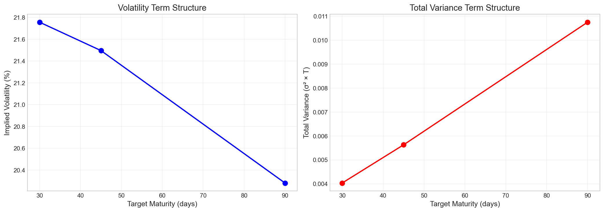
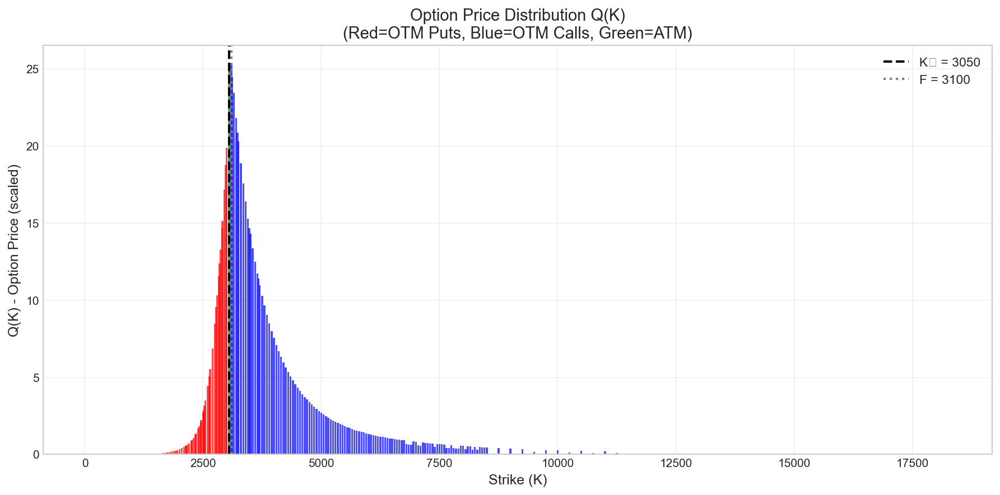
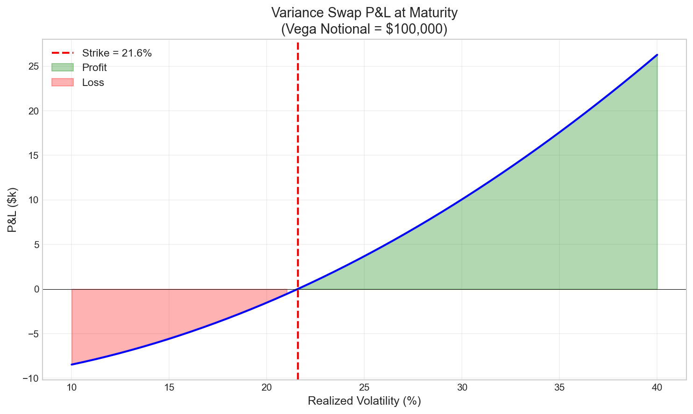
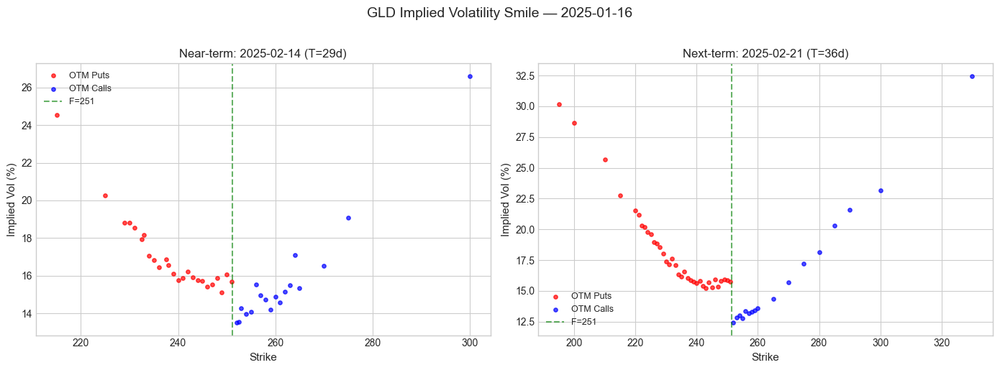
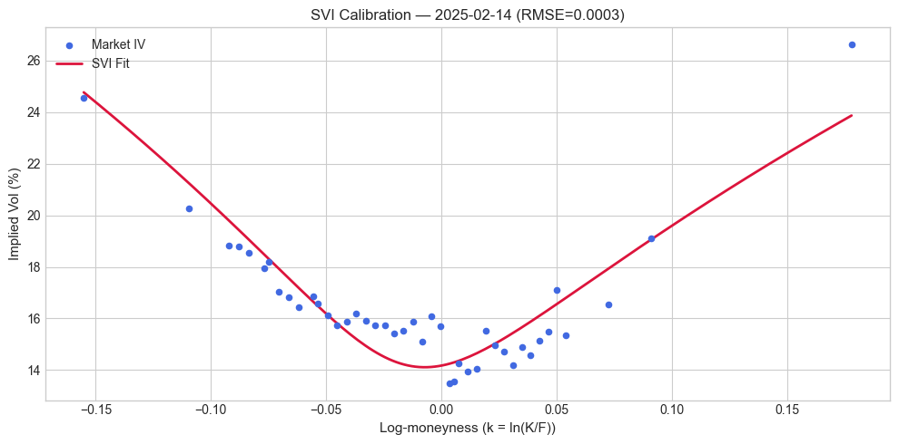
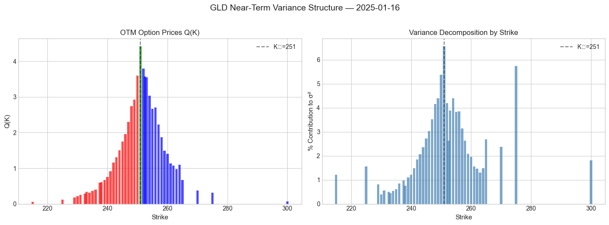
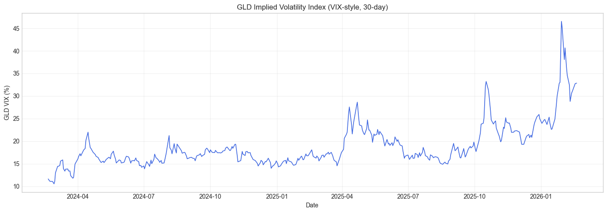

# VIX-Style Volatility Index Calculator

A production-grade Python implementation of the CBOE VIX methodology, adapted for commodity and equity options. Built from scratch — no third-party pricing libraries — with **variance swap pricing**, **implied volatility surface construction (SVI)**, **skew analysis**, **greeks**, and **backtesting** capabilities.

> **Structured Products Relevance** — This project demonstrates core competencies in volatility derivatives: variance swap replication, vol surface calibration, skew decomposition (RR25/BF25), corridor variance, and P&L attribution — the daily toolkit of a structuring desk.

---

## Sample Results

### Variance Term Structure
Near-term and next-term variance contributions interpolated to a 30-day horizon:



### OTM Option Price Distribution Q(K) & Variance Decomposition
Strike-level contributions to total implied variance — a key input for variance swap replication:



### Variance Swap P&L Simulation
Mark-to-market P&L of a variance swap position (Strike = 21.6%, Vega Notional = $100,000):



### GLD — Implied Volatility Surface (Near / Next Term)
Vol smile extracted from 800K+ option quotes across 502 trade dates:



### GLD — SVI Calibration (Gatheral) vs Market IV
Parametric fit of the near-term smile — RMSE = 0.000282:



### GLD — Variance Decomposition by Strike
Q(K) distribution and per-strike contribution to total implied variance:



### GLD — VIX Backtest (399 Trade Dates)
Implied volatility index computed daily over 2 years — Mean: 18.72%, Min: 10.55%, Max: 46.54%:



---

## Key Quantitative Results

| Metric | Value |
|:-------|:------|
| **GLD Implied Vol Index (30-day)** | 16.32% |
| **Henry Hub Implied Vol Index (90-day)** | 20.28% |
| **GLD Backtest** — dates computed | 399 (2024–2026) |
| **GLD VIX** — mean / min / max | 18.72% / 10.55% / 46.54% |
| **SVI Calibration RMSE** (near-term) | 0.000282 |
| **ATM Vol** (GLD, 2025-02-14) | 13.51% |
| **25Δ Risk Reversal** | −1.43% |
| **25Δ Butterfly** | 1.50% |
| **GLD Options Dataset** | 800,067 rows × 502 trade dates |
| **Test Suite** | 72 unit & integration tests |

---

## Overview

This project computes a VIX-style implied volatility index from an options chain, following the methodology described in the [CBOE VIX White Paper](http://www.cboe.com/micro/vix/vixwhite.pdf).

### Key Features

- **CBOE-aligned variance swap replication formula** — exact discrete sum over OTM strikes
- **Multi-asset support**: Henry Hub Natural Gas options + GLD (Gold ETF) options
- **Implied volatility surface** extraction & **SVI calibration** (Gatheral parameterization)
- **Skew analysis**: Risk Reversal 25Δ, Butterfly 25Δ, term structure
- **Variance swap pricing**: fair strike, corridor variance, forward variance, notional conventions
- **Greeks & risk decomposition**: per-strike variance contribution, vega buckets, ∂VIX/∂S
- **Backtesting engine**: full VIX time series, 3 realized vol estimators (Close-Close, Parkinson, Yang-Zhang), Variance Risk Premium
- **72 unit & integration tests**, CI pipeline (Python 3.11 / 3.12 / 3.13)

---

## Mathematical Methodology

### 1. Forward Price (F) and ATM Strike (K₀)

For each expiration term:

1. Find strike K\* that minimizes |Call(K\*) − Put(K\*)|
2. Compute forward: `F = K* + exp(rT) × (Call(K*) − Put(K*))`
3. ATM strike: `K₀ = max{K : K ≤ F}`

### 2. Option Selection Q(K)

Following CBOE methodology, we construct Q(K) using out-of-the-money options:

- **K < K₀**: Use put prices
- **K > K₀**: Use call prices
- **K = K₀**: Use average: `Q(K₀) = (Call(K₀) + Put(K₀)) / 2`

**Exclusion rule:** Stop including strikes after 2 consecutive zero-price quotes (from K₀ outward).

### 3. Strike Intervals (ΔK)

```
ΔKᵢ = (Kᵢ₊₁ − Kᵢ₋₁) / 2    for interior strikes
ΔK₁ = K₂ − K₁               for first strike
ΔKₙ = Kₙ − Kₙ₋₁             for last strike
```

### 4. Variance Contribution (σ²)

```
σ² = (2/T) × Σᵢ (ΔKᵢ/Kᵢ²) × e^(rT) × Q(Kᵢ)  −  (1/T) × (F/K₀ − 1)²
```

### 5. VIX Interpolation

The final VIX interpolates between near-term (T₁) and next-term (T₂) variances to a target maturity:

```
VIX = 100 × √[ (w₁ + w₂) × (N_year / N_target) ]

where:
  w₁ = T₁ × σ₁² × (N₂ − N_target) / (N₂ − N₁)
  w₂ = T₂ × σ₂² × (N_target − N₁) / (N₂ − N₁)
```

### 6. SVI Calibration (Gatheral)

The implied volatility smile is fitted using the Stochastic Volatility Inspired (SVI) parameterization:

```
w(k) = a + b × (ρ × (k − m) + √((k − m)² + σ²))
```

where `k = ln(K/F)` is log-moneyness. Parameters are optimized via least-squares minimization subject to no-arbitrage constraints.

**Calibrated parameters** (GLD near-term, 2025-02-14):

| Parameter | Value |
|:----------|:------|
| a | 0.000587 |
| b | 0.024729 |
| ρ (rho) | −0.199208 |
| m | −0.015576 |
| σ (sigma) | 0.041049 |
| **RMSE** | **0.000282** |

---

## Project Structure

```
vix-calculator/
├── src/
│   ├── __init__.py             # 28 public exports
│   ├── vix_index.py            # Core VIX calculation (Henry Hub + equity/ETF)
│   ├── implied_vol.py          # BS pricing, IV inversion, SVI calibration
│   ├── skew.py                 # Delta-based vol, RR25, BF25, term structure
│   ├── pricing.py              # Variance swap, corridor, forward variance
│   ├── greeks.py               # Variance decomposition, vega buckets, ∂VIX/∂S
│   ├── backtest.py             # VIX time series, realized vol, VRP
│   ├── preprocess_gld.py       # Polygon.io GLD minute data → daily CSV
│   └── fetch_treasury_rates.py # Treasury CMT rate fetcher
├── tests/
│   ├── test_vix_index.py       # 21 core VIX tests
│   ├── test_gld.py             # 16 GLD/equity tests
│   └── test_advanced.py        # 27 advanced module tests
├── data/                        # CSV data files
├── docs/                        # Visualizations (term structure, Q(K), var swap P&L)
├── scripts/
│   └── run_backtest.py          # Full VIX time series + realized vol + VRP charts
├── output/                      # Backtest results (generated)
├── demo.ipynb                   # Henry Hub interactive demo
├── demo_gld.ipynb               # GLD interactive demo (7 sections)
├── run.py                       # CLI entry point
├── .github/workflows/ci.yml     # CI pipeline
├── requirements.txt
├── pyproject.toml
└── README.md
```

---

## Key Assumptions & Differences from Official VIX

| Aspect | Official VIX (SPX) | This Implementation |
|:-------|:-------------------|:--------------------|
| Price source | Live bid-ask midpoint | Settlement prices (priorSettle) |
| Underlying | S&P 500 options | Commodity + equity options |
| Zero-bid rule | 2 consecutive zero bids | 2 consecutive zero settles |
| Time horizon | Fixed 30-day | Configurable |

---

## Installation

```bash
git clone <repository-url>
cd vix-calculator
python -m venv venv

# Activate (Windows PowerShell)
.\venv\Scripts\Activate.ps1

# Activate (Unix/macOS)
source venv/bin/activate

pip install -r requirements.txt
```

---

## Usage

### CLI — Henry Hub Natural Gas

```bash
python run.py
```

### CLI — GLD (Gold ETF)

```bash
python run.py --gld                    # Default date: 2025-01-02
python run.py --gld 2025-06-13         # Specific date
```

### Programmatic — Core VIX

```python
import pandas as pd
from src.vix_index import vix_index, vix_index_equity

# Henry Hub
result = vix_index(
    options_df=options, rates_df=rates, calendar_df=calendar,
    options_id=1352, trade_date="2020-11-12",
    front_months=2, rear_months=4, target_days=90, price_scale=100,
)
print(f"VIX: {result['vix']:.2f}")

# GLD (equity/ETF)
result = vix_index_equity(
    options_df=gld_options, rates_df=rates, calendar_df=calendar,
    trade_date="2025-01-02", target_days=30, price_scale=1.0,
)
```

### Implied Volatility Surface & SVI

```python
from src.implied_vol import implied_vol, build_iv_surface, calibrate_svi

# Extract IV for a single strike
iv = implied_vol(price=5.0, S=250.0, K=260.0, T=0.08, r=0.045, option_type="call")

# Build IV surface for one expiration
surface = build_iv_surface(options_df, forward=250.0, T=0.08, r=0.045)

# Calibrate SVI parametric smile
svi_params = calibrate_svi(moneyness=surface["moneyness"].values,
                           total_variance=(surface["iv"].values ** 2) * T)
```

### Skew Analysis

```python
from src.skew import compute_skew_metrics, skew_term_structure

# Single expiration: ATM vol, RR25, BF25
metrics = compute_skew_metrics(iv_slice, forward=250.0, T=0.08, r=0.045)
# → {'atm_vol': 0.1351, 'call_25d_vol': 0.1430, 'put_25d_vol': 0.1573,
#    'rr25': -0.0143, 'bf25': 0.0150}

# Across term structure
term = skew_term_structure(full_surface, forwards, times, rates)
```

### Variance Swap Pricing

```python
from src.pricing import (
    variance_swap_fair_strike, variance_swap_pnl,
    corridor_variance, forward_variance, forward_vol,
    vega_to_variance_notional, variance_to_vega_notional,
)

# Fair variance strike from VIX
k_var = variance_swap_fair_strike(result['sigma2_1'])

# Corridor variance swap (conditional on spot in [K_low, K_high])
corridor_var = corridor_variance(qk, F, K0, r, T, K_low=230, K_high=270)

# Forward variance / vol between two maturities
fwd_var = forward_variance(sigma2_near, sigma2_far, T_near, T_far)
fwd_vol = forward_vol(sigma2_near, sigma2_far, T_near, T_far)  # in %

# Notional conventions
n_var = vega_to_variance_notional(100_000, k_var)
n_vega = variance_to_vega_notional(n_var, k_var)  # roundtrip
```

### Greeks & Risk Decomposition

```python
from src.greeks import variance_decomposition, vega_bucket, spot_sensitivity

# Per-strike variance contribution (% of total σ²)
decomp = variance_decomposition(qk, r=0.05, T=0.25)

# Vega by maturity bucket (sensitivity per 1 vol-point shift)
vegas = vega_bucket(opts_front, opts_rear, r1, r2, T1, T2, target_days=30)
# → {'vega_front': 0.35, 'vega_rear': 0.12, 'vega_total': 0.47}

# Spot sensitivity: ∂VIX/∂S via bump-and-revalue
spot = spot_sensitivity(opts_front, opts_rear, r1, r2, T1, T2)
# → {'dvix_dspot_pct': -0.15, ...}
```

### Backtesting & Realized Volatility

```python
from src.backtest import (
    compute_vix_timeseries,
    realized_vol_close, realized_vol_parkinson, realized_vol_yang_zhang,
    variance_risk_premium,
)

# Compute VIX for all available trade dates
vix_ts = compute_vix_timeseries(gld_options, rates, calendar, target_days=30)

# Realized vol estimators (annualized)
rv_cc = realized_vol_close(prices, window=30)              # close-to-close
rv_pk = realized_vol_parkinson(high, low, window=30)       # Parkinson (1980)
rv_yz = realized_vol_yang_zhang(open_, high, low, close)   # Yang-Zhang (2000)

# Variance Risk Premium: VRP = IV² − RV²
vrp = variance_risk_premium(vix_series=vix_ts['vix'], realized_vol_series=rv_cc)
```

---

## Running Tests

```bash
pytest tests/ -v
```

```
72 passed in ~2s
```

---

## Required Data Files

Place in the `data/` directory:

1. **henry hub european options.csv** — CME Henry Hub options chain
2. **gld_options_daily.csv** — GLD daily options (generate with `python -m src.preprocess_gld`)
3. **treasury yield curve rates.csv** — US Treasury CMT rates
4. **cme holidays.csv** — CME holiday calendar

---

## Demo Notebooks

- **`demo.ipynb`** — Henry Hub: VIX calculation, variance term structure, Q(K) distribution, variance swap P&L
- **`demo_gld.ipynb`** — GLD (7 sections): VIX calculation, IV surface, vol smile, SVI calibration, skew analysis, variance decomposition, backtest results

---

## Adapting to Other Asset Classes

This implementation works with any options data following the required schema:

- **Equity indices** (SPX, SX5E, NKY)
- **FX options** (EUR/USD, USD/JPY)
- **Commodity options** (crude oil, natural gas, gold)

Adjust `price_scale` based on your data's strike/price units.

---

## References

- [CBOE VIX White Paper](http://www.cboe.com/micro/vix/vixwhite.pdf)
- Gatheral, J. (2004). *A parsimonious arbitrage-free implied volatility parameterization with application to the valuation of volatility derivatives*
- [The Fear Index: VIX and Variance Swaps](https://berentlunde.netlify.app/post/the-fear-index-vix-and-variance-swaps)
- [More Than You Ever Wanted to Know About Volatility Swaps](https://www.researchgate.net/publication/246869706)

---

## License

MIT License
